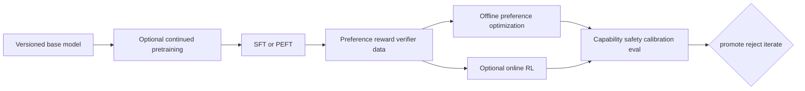

# Part 19 — Fine-Tuning, Preference Learning, and Post-Training

This part covers changing model behavior after pretraining: continued pretraining,
SFT, full and parameter-efficient fine-tuning, preference/reward models, DPO-like
objectives, PPO/GRPO-style online optimization, RLAIF, distillation, and the
rollout/evaluation systems around them.

## Prerequisites

Complete Parts 8, 13, 16–18. Complete Part 20 Chapters 1–4 before operating an
RLHF/PPO system; you may read this part’s SFT/PEFT/preferences sections first.

## Chapters

1. [Fine-tuning, preference learning, and post-training reference](01-post-training.md)
2. [Post-training data, objective, and systems laboratory](02-post-training-lab.md)

## Exit gate

You can choose among retrieval/prompting, SFT, LoRA/QLoRA, full fine-tuning,
preference optimization, online RL, and distillation from requirements; construct
correct token/loss masks; explain LoRA parameterization and quantized-base limits;
derive preference log-ratio intuition; prevent reward hacking/evaluator leakage;
and version rollout policy, reference, reward, tokenizer, and data together.

