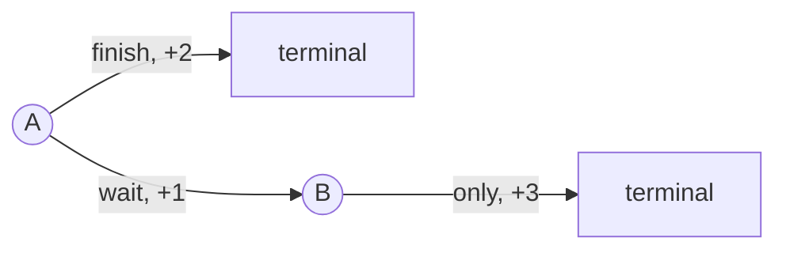

# Chapter 1 — MDPs, Bellman Equations, and Dynamic Programming

## 1. Decision problem before algorithm

Specify the environment before choosing an algorithm:

| Element | Question |
|---|---|
| State or observation | What information is available when acting? Is it sufficient? |
| Action | What can the agent control, and which actions are invalid? |
| Transition | How do state and action influence the next state? |
| Reward | Which immediate scalar signal is produced, by whom, and when? |
| Initial distribution | Where do episodes begin? |
| Termination | What ends naturally versus what is truncated by a time limit? |
| Discount | What effective horizon and mathematical objective are intended? |

A hidden user intent, unobserved velocity, or missing conversation history can make
the observation non-Markov even if the underlying simulator has a Markov state.

## 2. MDP notation

An MDP is commonly represented by `(S, A, P, R, γ, ρ₀)`:

- `S`: state space; `A`: action space;
- `P(s′ | s,a)`: probability of next state `s′`;
- expected immediate reward `r(s,a)` or a reward distribution;
- discount `γ`, usually between 0 and 1;
- initial-state distribution `ρ₀`;
- policy `π(a | s)`: action distribution conditioned on state.

The discounted return after time `t` is:

> `G_t = R_(t+1) + γ R_(t+2) + γ² R_(t+3) + ...`

Recursive form:

> `G_t = R_(t+1) + γ G_(t+1)`

`γ` is not merely “how patient the agent is.” It changes the objective, controls
the effective horizon (roughly on the order of `1 / (1 − γ)` when `γ < 1`), and
makes the discounted Bellman operator a contraction under standard bounded finite
conditions.

## 3. State, action, and advantage values

> `V^π(s) = E_π[G_t | S_t = s]`

> `Q^π(s,a) = E_π[G_t | S_t = s, A_t = a]`

> `A^π(s,a) = Q^π(s,a) − V^π(s)`

`V` evaluates a state under the policy; `Q` evaluates committing to an action and
then following the policy. Advantage measures an action relative to the policy’s
average choice in that state. For every state, the policy-weighted expected
advantage is zero.

## 4. Derive the Bellman expectation equation

Start from the return recursion and condition on the next state/action:

> `V^π(s) = Σ_a π(a|s) Σ_(s′,r) p(s′,r|s,a) [r + γ V^π(s′)]`

Every term has a job:

1. the policy weights current actions;
2. environment dynamics weight next outcomes;
3. immediate reward plus discounted continuation creates the one-step target.

The action-value form is:

> `Q^π(s,a) = Σ_(s′,r) p(s′,r|s,a) [r + γ Σ_(a′) π(a′|s′)Q^π(s′,a′)]`

Bellman optimality replaces the policy-weighted continuation with the best action:

> `V*(s) = max_a Σ_(s′,r) p(s′,r|s,a)[r + γV*(s′)]`

> `Q*(s,a) = Σ_(s′,r) p(s′,r|s,a)[r + γ max_(a′)Q*(s′,a′)]`

The `max` makes optimality nonlinear. It also creates maximization bias when noisy
estimates are used, motivating ideas such as Double Q-learning.

## 5. Worked two-state example

State `A` has two actions. `finish` gives reward 2 and terminates. `wait` gives
reward 1 and transitions deterministically to state `B`. In `B`, the only action
gives reward 3 and terminates. Let `γ = 0.9`.



Backward calculation:

> `V*(B) = 3`

> `Q*(A, finish) = 2`

> `Q*(A, wait) = 1 + 0.9 × 3 = 3.7`

Therefore waiting is optimal. If `γ = 0.2`, waiting is worth `1.6`, so finishing
is optimal. The policy changes because the stated objective changed.

## 6. Policy evaluation as a linear system

For a finite policy, collect state values in vector `v`, expected rewards in `r_π`,
and policy-induced transition matrix `P_π`:

> `v = r_π + γ P_π v`

Rearrange:

> `(I − γP_π)v = r_π`

> `v = (I − γP_π)⁻¹ r_π`

Direct solution can be expensive/ill-conditioned at scale. Iterative Bellman
updates exploit repeated matrix-vector structure and motivate sampled methods.

## 7. Dynamic-programming algorithms

### Iterative policy evaluation

Repeatedly replace each value with the Bellman expectation backup until the
maximum change is below a chosen tolerance.

```text
repeat:
  delta = 0
  for each state s:
    old = V[s]
    V[s] = expected reward plus discounted V of successors under policy
    delta = max(delta, absolute(V[s] - old))
until delta < tolerance
```

Synchronous updates read the previous sweep; in-place/asynchronous updates can
converge faster but make ordering relevant to intermediate values.

### Policy iteration

Evaluate current policy, then replace it with a greedy policy relative to its
evaluated values. Repeat until stable. Exact evaluation is unnecessary; modified
policy iteration blends partial evaluation and improvement.

### Value iteration

Apply Bellman optimality backups directly:

> `V_(k+1)(s) = max_a Σ_(s′,r) p(s′,r|s,a)[r + γV_k(s′)]`

Extract a greedy policy after convergence/tolerance. A value tolerance is not
automatically a policy-quality tolerance; relate stopping criteria to reward scale
and discount.

## 8. Terminated versus truncated

Natural terminal states have no continuation in the task objective. A time limit
may truncate an otherwise continuing episode. If code treats every time-limit
truncation as true terminal, it zeros the bootstrap target and underestimates
value near the limit. Modern environment APIs often expose separate flags; preserve
and test them.

## 9. Common modeling failures

- Reward is computed from information unavailable at decision time.
- Observation aliases materially different hidden states.
- Reset distribution differs from intended deployment population.
- Invalid actions are silently converted into another action.
- Reward scale or episode length changes across experiment variants.
- Simulator exploits permit reward without solving the intended task.
- Evaluation uses exploratory/noisy actions despite claiming greedy performance.

## 10. Mastery exercises

1. Solve a three-state stochastic MDP both as equations and by value iteration.
2. Construct an example where immediate greedy reward is globally suboptimal.
3. Prove from definitions that the policy-weighted expected advantage is zero.
4. Explain the role of `γ` in an episodic task where termination is guaranteed.
5. Write tests that distinguish natural termination from a time-limit truncation.
