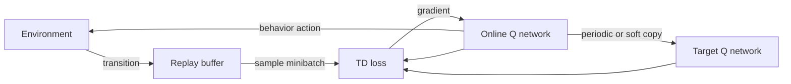

# Chapter 2 — Monte Carlo, TD, Q-Learning, and DQN

## 1. Three ways to construct a target

| Method | Target idea | Bootstrap? | Wait for episode? | Typical bias/variance |
|---|---|---:|---:|---|
| Monte Carlo | complete sampled return `G_t` | no | yes | low target bias, high variance |
| TD(0) | `r + γV(s′)` | yes | no | biased while estimate is wrong, lower variance |
| n-step | rewards for `n` steps plus bootstrap | yes | no | adjustable trade-off |

For a value estimate `V(s)` and target `Y`, the incremental update is:

> `V(s) ← V(s) + α [Y − V(s)]`

The bracketed quantity is the prediction error. In TD(0):

> `δ_t = R_(t+1) + γV(S_(t+1)) − V(S_t)`

## 2. Eligibility traces and TD(λ)

An eligibility trace assigns decaying credit to recently visited state/features.
The forward view mixes n-step returns with weights governed by `λ`; the backward
view updates traces online. Roughly, `λ = 0` resembles one-step TD and `λ → 1`
approaches Monte Carlo in episodic settings. Exact equivalence conditions and
trace variants (accumulating, replacing, true online) matter in implementations.

## 3. Control: SARSA and Q-learning

On-policy SARSA target:

> `Y = r + γ Q(s′, a′)` where `a′` is sampled from the behavior policy.

Off-policy Q-learning target:

> `Y = r + γ max_(b) Q(s′, b)`

SARSA learns the value of its exploratory behavior; Q-learning targets a greedy
policy while behavior may remain exploratory. Off-policy does not mean “any data
is safe”: coverage and function-approximation stability still matter.

### Tiny numerical update

Suppose `Q(s,a)=1.2`, reward is 2, `γ=0.9`, best next Q is 3, and `α=0.1`.

> target `Y = 2 + 0.9 × 3 = 4.7`

> TD error `δ = 4.7 − 1.2 = 3.5`

> new value `= 1.2 + 0.1 × 3.5 = 1.55`

Before coding, you should predict that the estimate increases.

## 4. Exploration is part of the data distribution

`ε`-greedy selects a random action with probability `ε`; otherwise a greedy
action. For `|A|` actions, if random choice includes the greedy action, the greedy
action probability is `1 − ε + ε/|A|`.

Alternatives include softmax/Boltzmann sampling, optimistic initialization,
upper-confidence bonuses, Thompson sampling, entropy regularization, parameter
noise, and intrinsic motivation. Selection depends on uncertainty structure,
safety, state/action scale, and whether online experimentation is allowed.

Report performance of the deployment/evaluation policy separately from reward
collected by exploratory training behavior.

## 5. Why naive deep Q-learning is unstable

The combination of function approximation, bootstrapping, and off-policy data is
the “deadly triad.” A network’s target depends on its own moving predictions;
consecutive experience is correlated; a parameter update changes many state-action
values; maximization can amplify overestimation.

DQN stabilizers:

1. replay buffer breaks short-range correlation and reuses experience;
2. target network changes more slowly than the online network;
3. clipped/robust loss reduces the effect of extreme TD errors;
4. gradient clipping and observation/reward treatment improve numerics;
5. explicit exploration supplies behavioral coverage.

## 6. DQN data path

For a batch, a common target is:

> `y_i = r_i + γ (1 − terminated_i) max_a Q_target(s′_i,a)`

> `L = mean_i Huber(y_i − Q_online(s_i,a_i))`

Do not multiply the bootstrap by zero for a mere time-limit truncation unless that
matches the actual objective/continuation convention.

## 7. Important DQN extensions

- Double DQN uses online network to select and target network to evaluate, reducing
  maximization bias.
- Dueling networks estimate a state value and relative action advantages; combine
  them with an identifiability correction.
- Prioritized replay samples high-error transitions more often and needs
  importance weighting to correct induced bias.
- Multi-step returns propagate reward faster but interact with off-policy data.
- Distributional RL models a distribution over returns, not only its expectation.
- Noisy networks learn parameterized exploration.

Compare extensions against a strong, tuned, same-budget baseline. Stacking every
idea prevents causal interpretation.

## 8. Replay-buffer correctness

Store observation, action, reward, next observation (or reconstruct safely),
termination, truncation, and any policy/log-probability metadata required. Test
wrap-around, sampling indices, frame stacking across boundaries, dtype/range,
reward transforms, and persistence/versioning.

Replay contents define a changing training distribution. Log buffer age, action
coverage, reward/episode-length distribution, and terminal causes—not only loss.

## 9. Evaluation protocol

Use fixed documented environment versions and wrappers, multiple seeds, separate
training and evaluation randomness, a fixed interaction budget, and uncertainty
over independent runs. Report area-under-learning-curve/sample efficiency as well
as final reward when relevant. Wall-clock and compute matter because two agents
may consume the same transitions with radically different update cost.

Do not smooth away instability or select only successful seeds. Show individual
seed traces or robust summaries alongside intervals.

## 10. Debugging order

1. random and simple heuristic baselines;
2. environment/reset/termination/reward invariants;
3. shapes, dtypes, action bounds, and device placement;
4. hand-calculated one-transition target;
5. overfit a tiny fixed batch;
6. verify target network has no unintended gradient;
7. inspect Q scale, TD error, gradient norm, actions, and replay composition;
8. only then tune architecture and hyperparameters.

## 11. Exercises

Implement a tabular agent and DQN on the same discrete task. Ablate replay and
target network separately. Predict the failure before running. Plot median return
plus seed traces, Q magnitude, TD-error distribution, and action entropy. Explain
why a falling TD loss can coexist with a worse policy.
