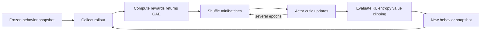

# Chapter 3 — Policy Gradients, Actor–Critic, and PPO

## 1. Optimize the policy directly

Let a differentiable stochastic policy be `π_θ(a|s)` and objective `J(θ)` be
expected return. The likelihood-ratio identity gives a policy-gradient form:

> `∇J(θ) = E_[τ~πθ] [Σ_t ∇ log π_θ(a_t|s_t) G_t]`

Intuition: increase log-probability of sampled actions with above-baseline returns
and decrease it for below-baseline returns. This is an expectation estimator, not
a supervised target telling the unique correct action.

## 2. Why a baseline does not introduce bias

For any state-only baseline `b(s)`:

> `E_[a~π] [∇ log π(a|s) b(s)] = b(s) ∇ Σ_a π(a|s) = b(s) ∇1 = 0`

Subtracting a state baseline therefore preserves the expected gradient while it
can reduce variance. With `b(s) ≈ V^π(s)`, the weight becomes an advantage estimate.

## 3. REINFORCE

For episodic sampled returns:

> `L_policy = − mean_t [ stop_gradient(G_t − b(s_t)) × log π_θ(a_t|s_t) ]`

The stop-gradient is crucial when the baseline/advantage is treated as a target
for the actor. Normalize advantages cautiously; it changes optimization scale and
batch coupling, though commonly improves conditioning.

REINFORCE is unbiased under its sampling assumptions but usually high variance and
sample inefficient. It is a valuable correctness baseline.

## 4. Actor–critic

The actor represents the policy; the critic estimates value/action-value to build
lower-variance advantages. A one-step estimate is TD error:

> `Â_t = r_(t+1) + γV_φ(s_(t+1)) − V_φ(s_t)`

Typical combined objective contains:

- policy loss weighted by detached advantage;
- value regression loss to a bootstrapped/return target;
- entropy bonus encouraging non-degenerate exploration.

Actor and critic losses have different scales. Log each component, explained
variance/value error, entropy, gradient norms, and approximate policy change.

## 5. Generalized Advantage Estimation

Define TD residual:

> `δ_t = r_t + γV(s_(t+1)) − V(s_t)`

GAE forms:

> `Â_t = δ_t + (γλ)δ_(t+1) + (γλ)²δ_(t+2) + ...`

Lower `λ` relies more on the critic (more bootstrap bias, often lower variance);
higher `λ` approaches longer sampled returns (less bootstrap bias, more variance).
Mask true episode boundaries correctly and decide how time-limit truncation
bootstraps.

## 6. Importance ratios

When data came from old policy `π_old`, define per-action probability ratio:

> `r_t(θ) = π_θ(a_t|s_t) / π_old(a_t|s_t)`

Equivalent log-space computation is numerically preferable:

> `log r_t = log π_θ(a_t|s_t) − log π_old(a_t|s_t)`

Large ratios indicate the new policy assigns very different probability to sampled
actions. Long trajectory products can have extreme variance; practical algorithms
use approximations and limited policy change.

## 7. PPO clipped surrogate

The commonly used clipped term is:

> `L_clip = E[min(r_t Â_t, clip(r_t, 1−ε, 1+ε) Â_t)]`

Sign matters:

- for positive advantage, excessive probability increase is capped;
- for negative advantage, excessive probability decrease is capped;
- the minimum constructs a pessimistic surrogate for the sampled action.

PPO usually performs multiple minibatch epochs over a freshly collected rollout,
then discards/refreshes it. It is approximately on-policy. Clipping does not
guarantee a hard trust region, monotonic improvement, safety, or bounded global
KL. Monitor KL and often early-stop an update when it exceeds a target.

## 8. PPO rollout/update pipeline

Store old log probabilities and often old values with the rollout. Recomputing
“old” probabilities after parameters change makes the ratio wrong.

## 9. Entropy and exploration

For a discrete policy:

> `H(π(.|s)) = −Σ_a π(a|s) log π(a|s)`

An entropy bonus delays premature collapse but is not automatically directed
exploration. For continuous squashed Gaussian policies, account for the action
transformation’s log-Jacobian and bound handling; naive clipping changes the
executed distribution without matching logged probability.

## 10. Continuous-control families

| Method | Policy | Data | Core idea |
|---|---|---|---|
| DDPG | deterministic | off-policy replay | deterministic actor gradient plus critic |
| TD3 | deterministic | off-policy replay | twin critics, delayed actor, target smoothing |
| SAC | stochastic | off-policy replay | maximize reward plus entropy |
| PPO | stochastic | fresh/near-policy rollouts | clipped policy-ratio surrogate |

Off-policy methods can reuse data efficiently but are sensitive to critic error and
distribution shift. PPO is often simpler operationally but interaction hungry.

## 11. PPO failure checklist

- Old log probabilities changed or recomputed incorrectly.
- Advantage/return masks cross an episode boundary.
- Reward/value scales produce exploding updates.
- Too many epochs or high learning rate causes large KL despite clipping.
- Critic dominates shared representation or fails to fit.
- Entropy collapses early; action standard deviation hits numerical bounds.
- Evaluation uses stochastic actions or training normalization statistics wrongly.
- Vector-environment auto-reset loses terminal observation.

## 12. Interview derivations

1. Derive why a state baseline leaves expected policy gradient unchanged.
2. Explain PPO clipping separately for positive and negative advantages.
3. Why is replay of months-old data inappropriate for ordinary PPO?
4. How can reward improve while true task performance worsens?
5. Compare PPO and SAC under expensive environment interaction and cheap compute.
