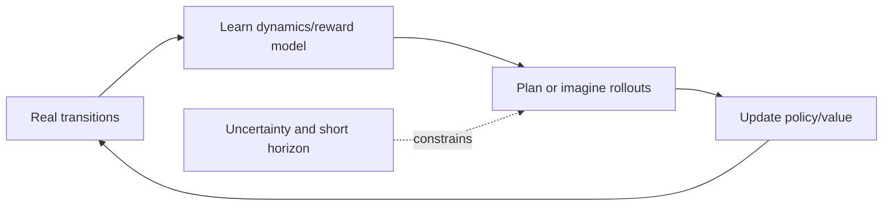
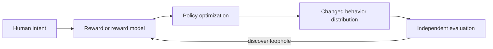
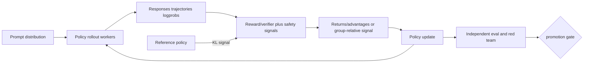

# Chapter 4 — Advanced, Offline, Model-Based, Safe, and Language-Model RL

## 1. Model-based RL

Model-based methods learn or use transition/reward dynamics, then plan or generate
synthetic experience. A model can reduce real interaction but introduces model
bias: planning deliberately searches for action sequences the imperfect model
predicts as good, including its errors.

Controls include uncertainty ensembles, pessimism, short model rollouts, regular
real-data refresh, and validation on policy-relevant state-action regions. One-step
prediction error can look good while long rollout error compounds.

## 2. Planning and search

- model-predictive control plans over a horizon, executes the first action, then
  replans from new evidence;
- Monte Carlo tree search balances expansion/exploration and value estimates;
- Dyna mixes real updates with model-generated planning updates;
- latent world models predict compact dynamics and rewards/values.

Planning budget belongs in evaluation cost. Comparing a heavily searched agent to
a one-forward-pass policy without accounting for latency/compute is misleading.

## 3. Offline RL and extrapolation error

Offline RL learns only from a fixed behavior dataset. It cannot collect corrective
experience when the learned policy chooses unsupported actions. A value function
may assign high value to out-of-distribution actions, and policy optimization then
seeks those mistakes.

Approach families:

- behavior cloning: conservative supervised baseline;
- policy constraints/regularization near behavior;
- conservative/pessimistic value objectives;
- advantage-weighted regression;
- sequence modeling of trajectories/returns;
- uncertainty-aware policy selection.

Always characterize coverage by state/action/return/time/source slices. A high
average behavior score does not imply coverage of actions needed for improvement.

## 4. Off-policy evaluation

Importance sampling reweights trajectories/actions using target-to-behavior policy
ratios. It can be unbiased with correct support and logged propensities, yet its
variance may be unusable over long horizons. Direct/model-based estimators trade
variance for model bias. Doubly robust estimators combine propensity correction
and an outcome/value model, but do not magically survive both being wrong.

Before trusting OPE:

1. verify action probabilities were logged at decision time;
2. inspect support overlap and weight concentration/effective sample size;
3. use clipping/self-normalization only with explicit bias discussion;
4. test estimators on policies with known online outcomes;
5. report uncertainty and slice-level failures;
6. use staged online validation when risk permits.

## 5. Constrained and safe RL

Represent reward objective and cost constraints separately:

> maximize `J_R(π)` subject to `J_Ck(π) ≤ d_k` for every constraint `k`

Lagrangian methods optimize reward minus learned penalties, but training-time
expectation constraints do not guarantee per-episode or worst-case safety. Combine
with action shields, hard feasibility rules, conservative deployment, monitoring,
and human approval where consequences demand it.

“Safe RL” can mean constrained exploration, robustness, risk-sensitive return,
avoidance of side effects, or safe deployment. Name the threat and guarantee.

## 6. Imitation and inverse objectives

Behavior cloning suffers distribution shift: small mistakes visit states absent
from demonstrations, causing compounding error. Interactive aggregation can query
an expert on learner-visited states but may be expensive/unsafe. Inverse RL and
adversarial imitation infer reward/occupancy structure, yet ambiguity remains:
many rewards explain the same demonstrations.

## 7. Partial observability and memory

In a POMDP, observations do not reveal the full state. A belief state is a
distribution over hidden states conditioned on history. Recurrent networks,
attention/history windows, learned state estimators, and active information-
gathering actions may help. Memory cannot recover information never observed; test
performance as a function of history and hidden-state aliasing.

## 8. Multi-agent and non-stationarity

Other agents learn/react, making the environment non-stationary from one agent’s
view. Centralized training with decentralized execution can use joint information
during learning while respecting execution constraints. Evaluation must cover
partner/opponent diversity, equilibria/exploitability where appropriate,
coordination failures, collusion, and robustness to unseen policies.

## 9. Reward specification and hacking

Optimization pressure exposes proxy loopholes. Hold out independent evaluators,
adversarially search for high-reward/low-quality outputs, monitor components and
constraints, cap optimization steps, and preserve rollback. Reward-model score is
not the ground-truth outcome.

## 10. Mapping language modeling to RL

For autoregressive post-training:

- state: prompt plus generated prefix (and tool/environment state if any);
- action: next token, tool call, or higher-level choice;
- policy: language model;
- episode: generated response/interaction trajectory;
- reward: preference model, verifier, rule, task/environment outcome, or mixture;
- reference policy: anchor used to penalize excessive drift.

Sequence-level reward creates a long credit-assignment problem. Token-level value
estimates/advantages spread learning signal; a KL penalty or constraint controls
departure from a reference but does not guarantee semantic safety.

## 11. RLHF systems loop

The rollout policy/version, tokenizer, sampling parameters, reward model, reference,
and trainer must agree. Stale rollouts make policy-ratio or KL interpretation
incorrect. Throughput engineering must not erase provenance.

## 12. PPO, GRPO-like, and preference alternatives

- PPO-style LM RL trains critic/value estimates and clipped policy updates from
  rollouts; it is flexible but system- and hyperparameter-heavy.
- Group-relative policy optimization variants compare multiple responses to the
  same prompt and normalize/group their rewards, often avoiding a separate value
  model; behavior depends strongly on group diversity, reward quality, and exact
  objective.
- DPO-like preference optimization uses chosen/rejected pairs and a reference-
  relative log-ratio classification objective without online environment rollouts;
  it is not generally equivalent to optimizing arbitrary long-horizon outcomes.
- RLAIF uses AI-generated feedback/critique under an explicit constitution/rubric;
  evaluator bias and correlated failures require independent human/safety checks.

Do not describe SFT, DPO, rejection sampling, PPO, or GRPO as universally ordered
replacements. They use different data, estimators, infrastructure, and objectives.

## 13. Language-model RL diagnostics

Track task/safety outcomes in addition to training reward:

- reward mean/distribution and each component;
- KL to reference by prompt/output-length slice;
- entropy, response length, stop reasons, invalid/tool actions;
- policy ratios/clipping fraction and advantage statistics;
- reward-model confidence/disagreement and suspicious high-score outputs;
- held-out capabilities, calibration, diversity, style, refusal/helpfulness;
- throughput, stale-policy age, failures, and cost per accepted trajectory.

## 14. Senior design exercise

Design RL post-training for a tool-using coding model. Define state/action granularity,
sandbox and permissions, trajectory schema, reward/verifier attack surface, credit
assignment, rollout concurrency, policy versioning, off-policy tolerance, KL,
safety constraints, independent evaluation, rollback, and evidence that the policy
did not merely learn to exploit tests.
