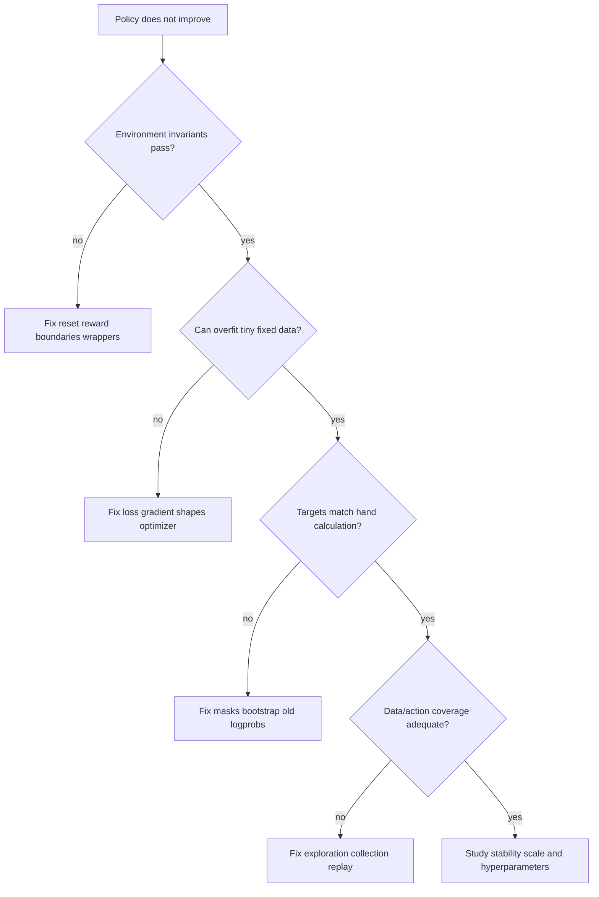

# Chapter 5 — Reinforcement Learning Implementation and Interview Workbook

## 1. Implementation progression

Build in this order and retain one shared environment test suite:

1. random and heuristic policies;
2. exact policy/value iteration on finite known dynamics;
3. Monte Carlo prediction and TD(0);
4. SARSA and Q-learning;
5. DQN with replay/target network;
6. REINFORCE;
7. actor–critic and PPO or SAC;
8. one offline/OPE or model-based study;
9. optional tiny language-model preference/RL experiment.

Each implementation needs deterministic unit fixtures and multi-seed empirical
evaluation. Framework output matching itself is not a proof; derive at least one
hand-computable target and gradient-direction check.

## 2. Environment contract tests

- reset follows declared initial distribution and returns schema/dtype;
- every action is valid, rejected, or masked according to explicit semantics;
- transition/reward on a tiny fixture matches hand calculation;
- random seeds produce repeatable sequences where promised;
- terminated and truncated are distinct and wrappers preserve them;
- observations do not expose hidden target/future information;
- vector auto-reset preserves terminal observation/info;
- normalization state is frozen and versioned during evaluation.

## 3. Algorithm unit tests

| Component | High-signal test |
|---|---|
| Return calculator | short reward sequence with known discounts/boundaries |
| TD target | terminal, nonterminal, and truncated one-transition cases |
| Replay | capacity wrap-around, shapes, sampling, boundaries, serialization |
| Epsilon-greedy | empirical action frequencies within tolerance |
| Target network | no gradient; exact/soft update matches formula |
| GAE | compare loop with hand-computed short trajectory |
| Policy ratio | equals one before actor update using stored old log-prob |
| PPO clip | positive and negative advantage boundary cases |
| Squashed action | action bounds and corrected log-probability |
| Distributed rollout | unique trajectory IDs and exact policy version |

## 4. Minimum experiment table

| Question | Required comparison |
|---|---|
| Does learning occur? | random/heuristic and algorithm under equal interaction budget |
| Is result robust? | predefined independent seeds, intervals, individual traces |
| Which component matters? | one-factor ablations with same tuning fairness |
| Is it efficient? | environment steps, updates, wall time, compute, memory |
| Is it safe? | constraint violations, worst slices, catastrophic episodes |
| Is improvement real? | unchanged evaluation protocol and honest selection process |

## 5. Learning-curve interpretation

A correct plot states x-axis (environment steps, episodes, updates, or wall time),
aggregation unit, smoothing, seeds, interval type, and evaluation policy. Never
average episodes of different lengths without explaining weighting.

```text
Raw seed traces reveal collapse and outliers.
Median summarizes a typical run.
Mean can be dominated by rare successes/failures.
Confidence interval uncertainty depends on independent runs, not timestep count.
```

## 6. Debugging decision tree



## 7. Failure-analysis cases

### Case A — Reward rises, success falls

Inspect reward components, response/episode length, termination, exploited simulator
states, independent task metric, and high-reward examples. Treat as proxy hacking
until evidence says otherwise.

### Case B — DQN loss decreases, Q values explode

Check reward scale, terminal mask, target-network updates, max bias, replay age,
optimizer/gradient norm, target distribution, and whether loss is merely tracking
a moving divergent target.

### Case C — PPO KL spikes after several epochs

Verify stored old log-probs, ratio calculation, learning rate, advantage scale,
minibatch reuse/epochs, entropy, clip fraction, and early-stop threshold. Clipping
does not eliminate large aggregate policy movement.

### Case D — Offline policy scores high in OPE but fails online

Audit propensities/support, weight concentration, behavior/evaluation mismatch,
model misspecification, tuning on the OPE estimator, unobserved confounding, and
confidence intervals. Roll out conservatively behind guardrails.

## 8. Core interview questions

1. Derive Bellman expectation from recursive return.
2. Compare Monte Carlo and TD in bias, variance, online use, and task boundaries.
3. Why can off-policy learning diverge with function approximation?
4. Explain Double DQN without saying only “two networks.”
5. Derive the state-baseline identity in policy gradients.
6. Explain GAE’s `λ` trade-off and boundary masking.
7. Explain PPO clipping for both advantage signs and its non-guarantees.
8. Compare PPO, SAC, and behavior cloning under expensive interaction.
9. What makes offline RL harder than ordinary supervised learning?
10. Design an OPE validation program before trusting it for launch.
11. How does model bias compound under planning?
12. Translate an LLM agent trajectory into state, action, reward, policy, and
    constraint definitions.

## 9. Senior system-design prompt

You have 10,000 simulators, 256 learner GPUs, preemptions, a versioned reward
model, and a safety budget. Design collection, queues/backpressure, policy and
trajectory identity, learner synchronization, replay/retention, checkpointing,
evaluation gates, observability, fault tolerance, and rollback. State where data
becomes off-policy and how you measure/limit staleness.

## 10. Mastery rubric

- Foundation: solve finite MDPs and calculate returns/TD updates.
- Implementation: pass component tests and learn reproducibly on small tasks.
- Production: operate rollout/training/evaluation with versioning and recovery.
- Advanced: diagnose estimator/objective mismatch, distribution shift, reward
  exploitation, and system-induced bias; design a discriminating ablation.

Do not claim mastery from one successful seed or a library call.
