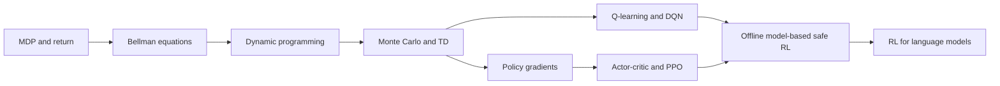
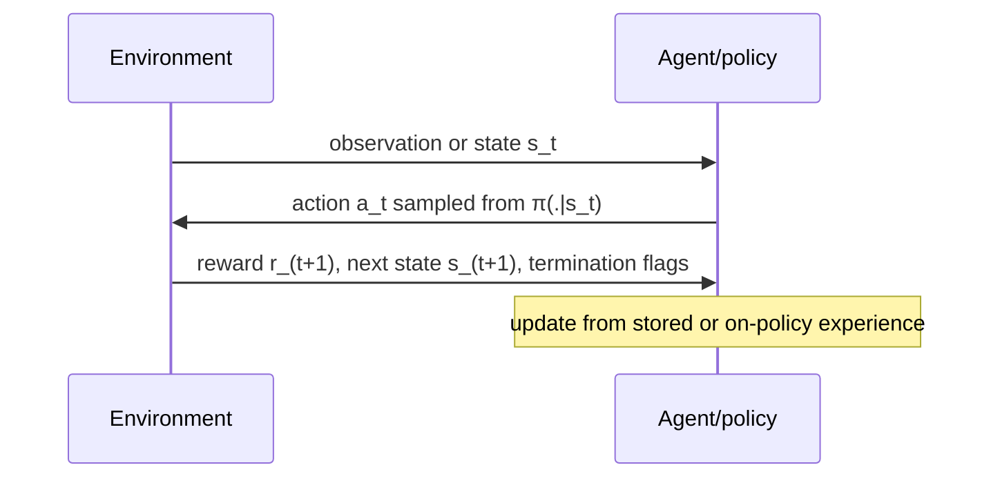

# Part 20 — Reinforcement Learning

Reinforcement learning studies sequential decisions under uncertainty: an agent’s
actions change later observations, rewards, and available choices. This part moves
from exact finite MDPs to sampled tabular methods, deep value and policy methods,
offline/safe/model-based RL, and RL used in language-model post-training.

## Prerequisites

Complete Parts 2, 5, and 7. Know conditional probability, expectation, gradients,
neural-network training, train/evaluation leakage, and basic optimization. Part 8
is required before the language-model RL sections; Part 19 is recommended.

## The learning path

## Read in this order

| Chapter | Learning outcome |
|---:|---|
| 1 | [MDPs, Bellman equations, and dynamic programming](01-mdps-bellman-dynamic-programming.md): derive finite-MDP solutions by hand |
| 2 | [Monte Carlo, TD, Q-learning, and DQN](02-value-learning-and-dqn.md): implement and debug value learning |
| 3 | [Policy gradients, actor–critic, and PPO](03-policy-gradients-actor-critic-ppo.md): derive stochastic policy optimization |
| 4 | [Advanced RL and language-model RL](04-advanced-offline-modelbased-safe-lmrl.md): reason about distribution shift, models, constraints, and post-training |
| 5 | [Implementation and interview workbook](05-rl-workbook.md): prove mastery with code, diagnostics, and design cases |
| 6 | [Comprehensive theory reference](06-rl-comprehensive-reference.md): consolidate the complete algorithm map and precise vocabulary |

## One interaction loop

Do not begin with PPO—or with the comprehensive reference. Start at Chapter 1. If
you cannot solve a tiny MDP and predict the direction of
a TD update, deep-RL code will conceal rather than fix the missing mental model.

## Scope and honest expectations

These notes support strong engineering/interview foundations. Frontier RL research
also requires reading current papers, reproducing baselines, specialized theory,
large-scale rollout systems, and domain-specific simulators/evaluators. Algorithm
names are not mastery; stable evidence comes from learning curves across seeds,
strong baselines, ablations, environment audits, and failure analysis.

## Part project

Implement a small environment plus: dynamic programming (when the model is known),
tabular Q-learning, DQN, REINFORCE, and an advantage actor–critic or PPO baseline.
Use identical environment semantics and evaluation budgets. Report sample
efficiency, final performance, uncertainty across seeds, wall-clock cost,
constraint violations, and at least one failed hypothesis.

## Exit gate

You can derive Bellman expectation/optimality equations, distinguish on-policy
from off-policy data, explain bootstrapping bias and variance, derive a policy-
gradient estimator, describe PPO’s surrogate without calling clipping a guarantee,
identify offline extrapolation error, design OPE cautiously, and explain how
token-level actions/rewards/KL constraints change language-model RL.
