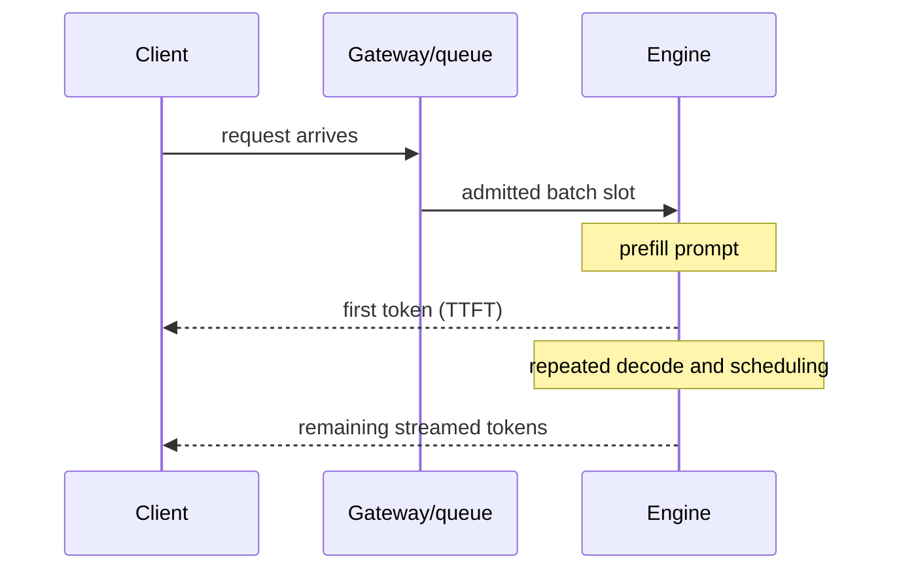

# Chapter 2 — Inference Benchmarking and Capacity Laboratory

## 1. Workload is part of the benchmark

Record arrival process/rate, prompt and generated-token joint distribution,
concurrency, streaming, sampling parameters, model/adapter mix, tool calls,
prefix reuse, cancellations, priority classes, warm/cold cache, and SLO. Uniform
synthetic lengths rarely represent production.

## 2. Latency decomposition

- queue time: admission to execution;
- TTFT: arrival to first visible token, dominated by queue/prefill plus overhead;
- inter-token latency: spacing during decode;
- end-to-end latency: arrival to finish/cancel;
- tokens/second: state whether per request, per replica, or aggregate;
- goodput: requests/tokens meeting quality and SLO, often the useful metric.

Report percentiles from request-level observations; do not compute a p99 by
averaging per-instance p99 values.

## 3. Open-loop versus closed-loop load

A closed-loop client waits for responses before sending more; when service slows,
offered load falls, hiding overload (coordinated omission). An open-loop generator
sends according to an external arrival schedule and measures queue growth/drops.
Use both for relevant questions, but capacity/SLO tests require realistic
independent arrivals.

## 4. Little’s Law

For a stable system over a representative interval:

> average concurrency `L = arrival rate λ × average time W`

If arrival rate is 20 requests/s and average time is 2 s, about 40 requests are in
the system on average. Tail capacity, nonstationarity, token heterogeneity, and
unstable overload require richer analysis; Little’s Law is a sanity check.

## 5. KV-cache worksheet

First-order per-sequence cache:

> `KV bytes ≈ 2 × layers × cached tokens × KV heads × head dimension × bytes/element`

Multiply by active sequences, then add block/allocator metadata, fragmentation,
prefix-cache retention, speculative tokens, adapters, model weights, workspace,
and safety margin. Measure actual allocator occupancy because kernels and engines
may store/cache differently.

## 6. Saturation experiment

Sweep offered arrival rate while holding workload distribution fixed. Plot achieved
throughput/goodput, queue depth, TTFT/ITL/end-to-end percentiles, batch occupancy,
KV utilization/evictions, GPU/CPU/network, cancellations, and rejection rate.

Identify the knee where queue/tail grows faster than goodput. Capacity is not the
highest rate that eventually completes; it is sustainable rate under SLO and
failure headroom.

## 7. Optimization experiments

### Continuous batching

Compare static batches and iteration-level admission. Measure throughput, fairness,
TTFT, decode latency, and memory under mixed lengths. A long prefill can starve
decode unless scheduling/chunking protects interactive traffic.

### Prefix caching

Measure hit rate by reusable token count, lookup/copy cost, eviction, tenant safety,
and invalidation identity. Cache keys must include model/tokenizer/adapters and
prompt bytes/tokens plus any behavior-changing configuration.

### Speculative decoding

Measure draft cost, acceptance rate by workload, verifier/target overhead, quality
equivalence, and tail latency. Speedup depends on cheap drafting and accepted runs;
low acceptance can make it slower.

### Quantization

Report weight/KV/activation scheme, calibration data, kernels/hardware, memory,
prefill/decode latency, throughput, energy/cost, and quality by sensitive slices.
Smaller weights do not guarantee faster end-to-end service if dequantization or
unsupported shapes dominate.

## 8. Capacity plan

Translate forecast into per-class token workload, benchmark-derived goodput per
replica, redundancy/failure reserve, rollout headroom, and autoscaling lag. Include
burst policy, maximum queue/deadline, rejection/degradation behavior, cold-start
and model-load time, and accelerator quota.

## 9. Tool comparison protocol

Compare vLLM, SGLang, TensorRT-LLM, or another engine only on supported exact model/
hardware/config versions with equal output semantics and quality. Record engine
commit/version, kernels, quantization, scheduler options, parallel topology, and
compilation/warm-up. Tool-brand benchmarks without configuration are not portable.

