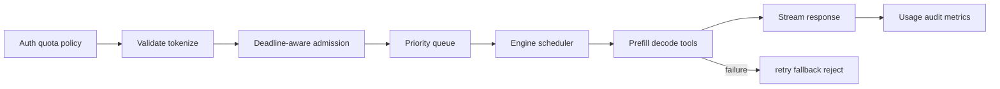

# Chapter 3 — Inference Reliability, Overload, and Multi-Tenancy Workbook

## 1. Request lifecycle and failure boundaries

Each boundary needs timeout, cancellation propagation, idempotency semantics,
resource accounting, and structured error classification.

## 2. Overload policy

When offered load exceeds sustainable capacity, queueing everything increases
tail latency, memory, timeout work, and retry storms. Use bounded queues,
deadline-aware admission, per-tenant quotas, rate limits, priority with starvation
controls, maximum input/output tokens, and early load shedding. Return explicit
retry guidance only when retry is likely safe/useful.

Graceful degradation may route to a smaller model, reduce max output, disable
expensive tools/features, use a cached result, or reject. Measure quality/safety
effects and never silently weaken a required safety policy.

## 3. Retry reasoning

Retry transient failures only within the client’s total deadline and idempotency
contract. Streaming generation may have emitted tokens or tool side effects; a
blind retry can duplicate actions/billing. Assign request/attempt/trajectory IDs
and distinguish replayable model computation from non-idempotent tools.

## 4. Deployment and rollback

Shadow tests observe behavior without serving it; canary sends limited real traffic;
progressive rollout expands after metric gates. Pin image, model, tokenizer,
quantization, engine, adapter, prompt/template, and policy versions. Rollback must
resolve immutable artifacts and compatible cache/checkpoint state.

Promotion signals include task/safety quality, TTFT/ITL/end-to-end tails, goodput,
errors, cancellations, queue/KV pressure, cost, and slice regressions. Average
latency alone is not a gate.

## 5. Multi-tenant isolation

- authenticate caller and authorize model/tool/data scope;
- enforce per-tenant quotas and concurrency before expensive work;
- prevent cross-tenant prefix/KV/result cache disclosure;
- isolate adapters and ensure cache keys include them;
- restrict logs/traces containing prompts, outputs, tokens, or credentials;
- sandbox tools and generated code; apply egress and filesystem policy;
- prevent one tenant’s long prompts from starving others;
- meter usage with auditable request/attempt identity.

## 6. Prompt/tool security

Treat retrieved documents, web pages, model output, and tool results as untrusted
data. Prompt text cannot enforce authorization. Tool calls must pass typed schema,
server-side authorization, least privilege, output limits, and human approval for
high-impact actions. Separate control instructions from untrusted content and test
indirect injection/data exfiltration.

## 7. Observability

Correlate request, tenant-safe trace, model/artifact versions, scheduler events,
token counts, cache events, tool calls, and errors. Metrics:

- arrival/admitted/rejected/completed/cancelled rates;
- queue depth/time by class;
- TTFT, ITL, end-to-end latency and goodput percentiles;
- prompt/generated tokens, active sequences, batch composition;
- KV occupancy/fragmentation/evictions and prefix hits;
- accelerator/CPU/memory/network/power where available;
- fallback/retry/tool failure and task/safety proxy with delayed ground truth.

Protect sensitive content with minimization, redaction, sampling, access controls,
retention, and audited break-glass procedures.

## 8. Incident drills

1. One replica returns corrupt tokens after an engine update. Identify artifact,
   traffic scope, quality gate failure, containment, rollback, and cache invalidation.
2. A long-context tenant causes p99 TTFT collapse. Diagnose scheduler fairness,
   chunked prefill, quotas, workload shift, and capacity.
3. Prefix cache leaks between tenants. Contain, invalidate, assess exposure, fix
   key/authorization design, and add adversarial isolation tests.
4. Tool timeout triggers duplicated external action on retry. Repair idempotency
   keys, cancellation, state machine, and user-visible status.

## 9. SLO design prompt

Define separate availability and latency SLOs by traffic class, what counts as a
valid request, streaming success, quality/safety guardrails, measurement point,
error budget, maintenance/exclusion policy, and actions at burn-rate thresholds.
An answer that ignores model-quality regressions is incomplete for ML serving.

