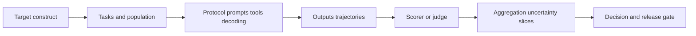

# Chapter 2 — Evaluation Design and Statistical Workbook

## 1. Measurement chain

Every arrow can introduce bias. A precise metric may measure the wrong construct;
a representative task set may be invalidated by leakage; a good scorer may fail
on a new model’s style.

## 2. Evaluation specification

Version dataset item IDs, population/sampling, prompt/template/few-shot examples,
tools/sandbox, model/tokenizer/system prompt, decoding and seeds, scorer/judge,
normalization, retries/timeouts, aggregation, exclusion, statistical plan, and
decision thresholds. Store predictions/trajectories so scores can be audited and
recomputed without rerunning the model.

## 3. Paired comparison

When models answer the same items, analyze per-item differences rather than treat
scores as independent. For accuracy, paired bootstrap over items or an appropriate
paired test can estimate uncertainty. For clustered items/users/prompts, resample
the independent unit (e.g., prompt group), not correlated rows as if independent.

Report effect size and interval, not only a p-value. Predefine primary endpoint and
minimum meaningful improvement; hundreds of sliced tests create false discoveries.

## 4. Bootstrap procedure

Given `n` evaluation units and score difference function:

1. sample `n` units with replacement;
2. compute paired aggregate difference;
3. repeat many times with recorded seed;
4. use the bootstrap distribution for an interval according to chosen method;
5. inspect whether heavy ties/clusters/small samples invalidate assumptions.

Bootstrap is not magic: the observed sample must represent the target population,
and resampling cannot reveal systematic evaluator bias.

## 5. Pass@k caution

For coding/math with multiple samples, distinguish empirical “at least one passes”
from estimators based on `n` samples and `c` correct. Sampling temperature, test
quality, sandbox, timeouts, duplicate solutions, and resource budget are part of
the metric. Pass@k rewards search budget; compare at equal generation/execution
cost where product decisions require it.

## 6. Calibration and selective prediction

Calibration asks whether confidence frequencies match outcomes. Selective systems
abstain/escalate below confidence and trade coverage for risk. Plot reliability by
domain/difficulty, report expected calibration error cautiously (bin-dependent),
Brier/log loss where suitable, and risk–coverage curves.

Self-reported language confidence may not be a well-calibrated probability. Define
the confidence source and outcome event.

## 7. Human evaluation audit

Specify rubric, training, blinding/randomized order, tie option, qualification,
quality controls, adjudication, agreement, sample size, slice coverage, pay/welfare,
and privacy. Pairwise preference is not automatically an interval-scale measure.
Annotator disagreement may reveal ambiguous tasks or plural values—not noise to
erase.

## 8. Model-judge audit

Validate against human-labeled/adjudicated cases across both model families,
lengths, languages, styles, safety categories, and adversarial inputs. Test order,
verbosity, self-preference, reference-answer leakage, prompt injection, and judge
version drift. Use structured rationales only as audit artifacts, not proof that
the hidden scoring process is faithful.

## 9. Agent evaluation

Evaluate outcome, trajectory cost, invalid actions, permission violations,
recovery, tool errors, latency, and reproducibility. Prevent test contamination
through tools/network, sandbox side effects, and cross-episode state. Count retries
and human interventions; success after unlimited hidden help is a different metric.

## 10. Error taxonomy

Sample failures and label root categories: missing knowledge, retrieval miss,
reasoning error, instruction conflict, tool selection/argument, execution, stale
state, hallucinated evidence, refusal, unsafe action, evaluator error, or ambiguous
task. Quantify categories and design experiments against the largest consequential
ones—not the most amusing examples.

## 11. Release scorecard

| Dimension | Gate style |
|---|---|
| Primary task | minimum effect and uncertainty requirement |
| Non-regression | protected capability/language/user slices |
| Safety/security | severity-weighted hard gates plus uncertainty |
| Privacy | memorization/extraction and data-governance checks |
| Reliability | error, timeout, tool/recovery and tail latency |
| Efficiency | cost, throughput, memory, energy where measured |
| Documentation | model/data/eval cards, known limits, rollback owner |

No weighted average should allow a severe safety regression to be canceled by a
small capability gain.

