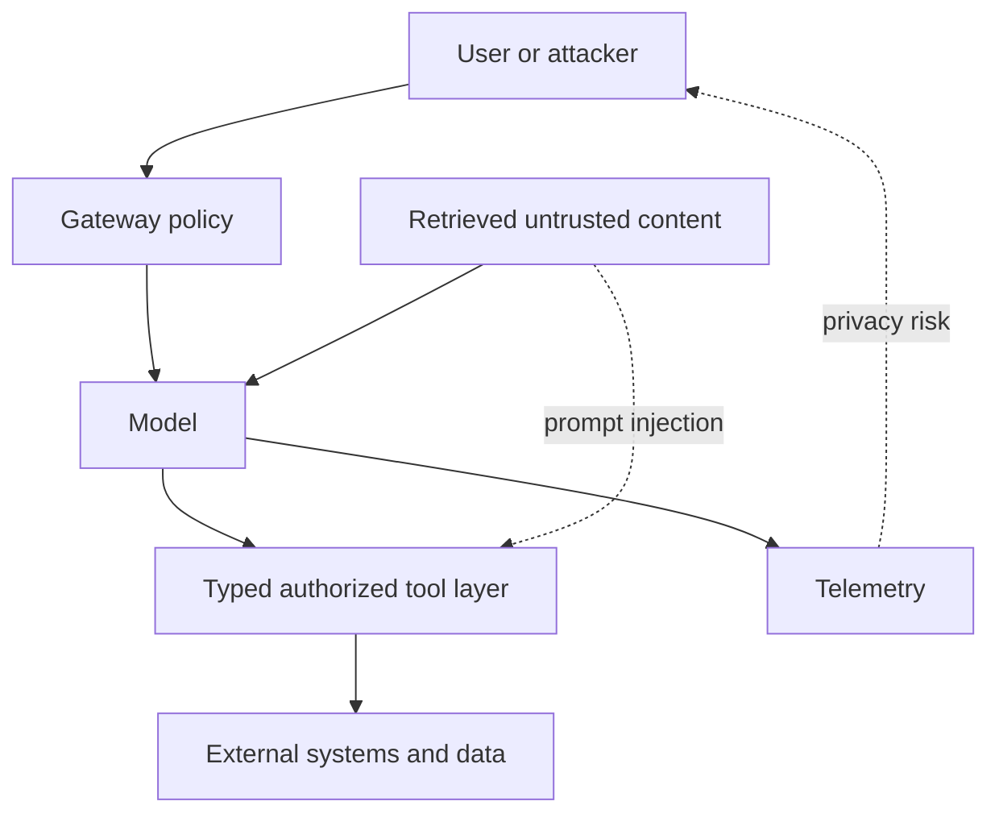

# Chapter 3 — Safety, Security, Privacy, and Red-Team Laboratory

## 1. Threat model first

Name assets, actors, trust boundaries, allowed actions, attacker knowledge/access,
impact, and out-of-scope claims. Safety (harmful outcomes), security (adversarial
violation of properties), privacy, robustness, and misuse overlap but require
different tests.

## 2. Prompt-injection lab

Create direct and indirect attacks in documents/tool output. Test instruction
hierarchy, data/control separation, tool authorization, secret access, egress,
encoding/obfuscation, multi-turn persistence, and agent memory poisoning. Refusal
text is not a security boundary; verify that unauthorized action/data never occurs.

## 3. Tool-use security lab

Use a sandbox with fake secrets and destructive-looking but harmless test actions.
Require typed arguments, allowlisted operations, server-side authorization,
least-privilege identity, idempotency, confirmation for high impact, output-size/
content limits, and audit trails. Fuzz schemas and tool outputs; model-generated
arguments are untrusted input.

## 4. Privacy evaluation

Test memorization/extraction with authorized canaries and controlled data,
membership-inference risk under a stated adversary, sensitive-data output filters,
training-data access/retention/deletion, logs/traces, and cross-tenant caches.
Do not expose real private data during a test. Differential privacy claims require
formal mechanism/accounting and utility evaluation, not “noise was added.”

## 5. Harm evaluation

Define taxonomy, severity, context, user vulnerability, language/culture, and
whether the model initiates, meaningfully facilitates, or safely redirects.
Measure overrefusal and refusal inconsistency alongside harmful compliance. Human
reviewers need welfare protections and escalation for disturbing content.

## 6. Red-team process

1. define threat hypotheses and success criteria;
2. build reproducible attacks and benign controls;
3. explore manually/automatically within authorization;
4. triage severity, exploitability, affected scope, and evidence;
5. contain critical findings and create regression tests;
6. mitigate at appropriate layer, then retest adaptive variants;
7. document residual risk and owner before release decision.

Keep red-team sets partly held out. Publishing every attack into development can
produce benchmark-specific defenses rather than general robustness.

## 7. Interpretability claim discipline

An attribution, probe, activation patch, feature visualization, or circuit
hypothesis is evidence under interventions/assumptions—not direct access to model
intent. Test faithfulness with counterfactual interventions, controls, stability,
causal effect, alternative explanations, and task/generalization scope. High probe
accuracy may show information is decodable, not that it is used.

## 8. Incident drills

- Retrieved page causes data exfiltration through a tool: contain credentials,
  audit calls, disable path, preserve evidence, fix authorization/data boundary.
- Model update sharply overrefuses one language: rollback/gate, slice analysis,
  data/evaluator audit, user-impact mitigation.
- Canary appears verbatim: verify provenance/access, contain model/log exposure,
  assess extraction conditions, retraining/deletion options and limitations.
- Judge was prompt-injected by candidate output: invalidate affected scores,
  isolate candidate content, harden scorer, independently rescore.

## 9. Deliverable

Produce a threat model, test matrix, reproducible fixtures, severity rubric,
findings with minimal evidence, mitigations by layer, regression suite, residual-
risk statement, and release recommendation. Do not include operational exploit
details beyond what authorized defenders require.

