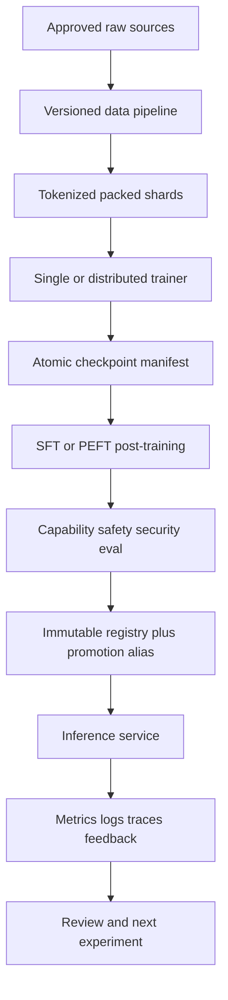

# Chapter 2 — End-to-End Foundation-Model Systems Capstone

## 1. Goal

Build a small but complete system whose rigor scales conceptually even if its model
does not. Train or continue-train a tiny transformer, apply SFT/PEFT, evaluate it,
serve it through a versioned API, and demonstrate reproducibility, observability,
failure recovery, and security boundaries.

## 2. Architecture

## 3. Required artifacts

- problem statement, non-goals, target users, harm/threat model;
- source/data card, immutable manifests, tokenizer report, decontamination audit;
- Git history, lockfile, non-root image digest/SBOM evidence, resolved configs;
- model configuration/accounting and single-device golden reference;
- training logs, numeric diagnostics, checkpoints, interruption/restore evidence;
- post-training mask tests, adapter/base identity, preference data audit if used;
- evaluation specification, predictions/trajectories, intervals and error taxonomy;
- serving benchmark with realistic lengths/arrivals and capacity calculation;
- API/data contracts, deployment/rollback, SLOs, dashboards, runbook, model card;
- final report including failures, ablations, limitations, cost, and decisions.

## 4. Milestones and gates

| Milestone | Gate before continuing |
|---|---|
| Data | rights/privacy/schema/dedup/decontamination/mixture and loader tests pass |
| Model | exact parameter/memory estimate and tiny forward/backward reference pass |
| Training | loss/masks/gradients stable; checkpoint round-trip and provenance pass |
| Scale | distributed equivalence and scaling value demonstrated, or remain single-device |
| Post-training | behavior change beats base on intended tasks without protected regression |
| Evaluation | frozen protocol, uncertainty, contamination, judge and red-team audits pass |
| Serving | quality-equivalent output, SLO/goodput under load, overload behavior pass |
| Release | immutable artifacts, staged rollout, rollback owner and residual risk accepted |

## 5. Required failure injections

1. corrupt or replace an input shard behind a stable name;
2. produce a code regression and locate it with a deterministic bisect test;
3. interrupt checkpoint publication and reject partial restore;
4. kill one distributed rank or worker and terminate peers coherently;
5. overload inference and demonstrate bounded admission/degradation;
6. inject malicious instructions through retrieved/tool content and prove
   authorization prevents the action;
7. introduce an evaluator version change and preserve both metric lineages.

## 6. Measurements

Training: valid loss tokens/s, step-time phases, accelerator/memory, gradient and
update norms, stability events, checkpoint time, scaling/cost. Quality: primary
effect with uncertainty, protected slices, calibration, safety/security, error
taxonomy. Serving: arrival/admission, goodput, TTFT/ITL/end-to-end tails, KV/cache,
failures/rejections, cost and quality under degradation.

## 7. Design document outline

1. context, goals, non-goals, constraints and scale estimates;
2. alternatives and why the selected baseline is credible;
3. data/model/training/post-training/evaluation architecture;
4. serving/API/state/consistency and capacity;
5. privacy, security, safety, abuse and governance;
6. reliability, failure modes, observability, SLO and incident response;
7. rollout, rollback, migrations and cost;
8. experimental results, uncertainty, limitations and future decisions.

## 8. Ruthless review rubric

Fail the capstone for unverifiable numbers, hidden notebook state, mutable artifact
identities, test-set tuning, no baselines, cherry-picked seeds, missing data rights,
training reward used as sole evaluation, container running privileged without
justification, partial checkpoints treated as valid, unrealistic load testing,
unbounded queues/retries, prompt text used as authorization, or undocumented
limitations.

Score senior quality on clarity of assumptions, invariant-driven tests, causal
experiments, measured trade-offs, graceful failure, security/privacy boundaries,
operational ownership, and decisions that remain coherent when constraints change.

